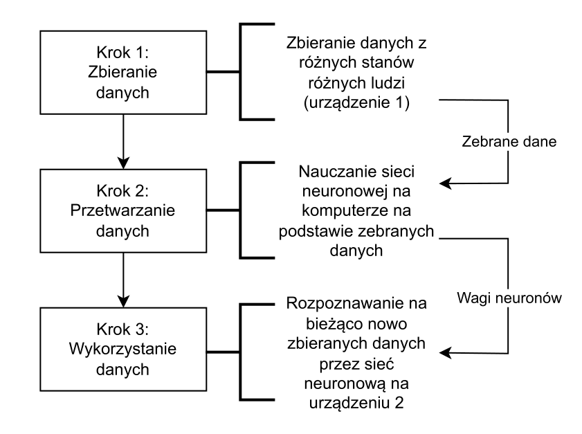
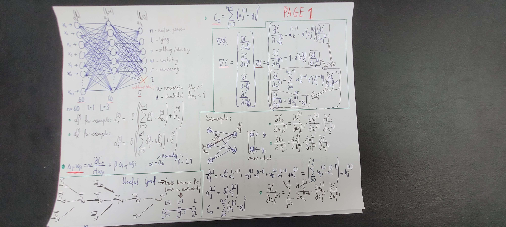
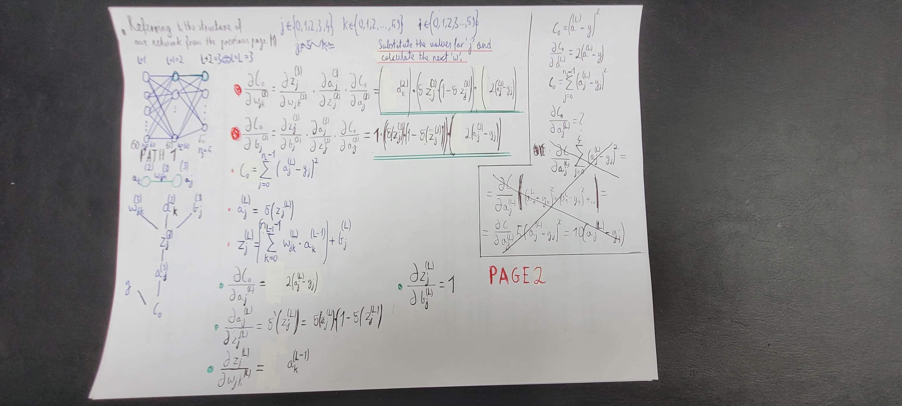
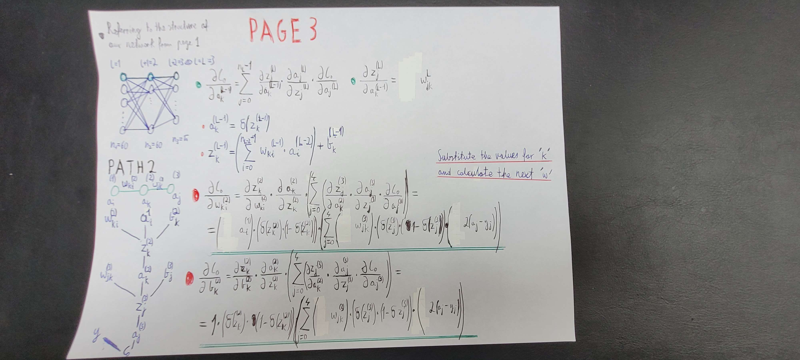

# Intelligent State Detector
The goal of this project is to create an AI that fits on a microcontroller and can differentiate between a person laying, standing, walking and running.
## Our plan

## Neural Network Schema

## TODO
- [x] Translate all materials to english
- [ ] Add license to project
- [ ] Create device schematic
- [ ] Acquire all components for the device
- [ ] Design and 3D print the case
- [ ] Assemble the device
- [ ] Write data gathering firmware (C++ / MicroPython) for MCU
- [ ] Collect data
- [ ] Design the neural network
- [ ] Write machine learning software for PC
- [ ] Train neural network
- [ ] Write final firmware for MCU (C++)
- [ ] Test device
- [ ] Write documentation
